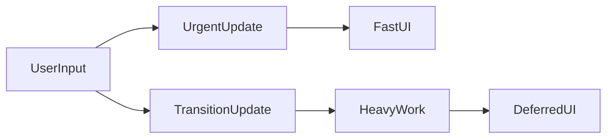

# startTransition / useTransition

## Problem

Some updates should feel **instant** (typing in a box). Others can wait (filtering a huge list). If everything has the same priority, heavy work makes the UI **feel stuck**.

## How to use

Mark **non-urgent** updates as transitions:

- **`useTransition`** returns `[isPending, startTransition]` in components.
- **`startTransition`** can also be imported from `react` and used outside components (where appropriate).

Updates inside `startTransition` can be **interrupted** so urgent updates (like keystrokes) stay responsive.

## Examples

```jsx
import { useState, useTransition } from "react";

function Search({ items }) {
  const [q, setQ] = useState("");
  const [filtered, setFiltered] = useState(items);
  const [isPending, startTransition] = useTransition();

  function onChange(e) {
    const value = e.target.value;
    setQ(value); // urgent: keep input snappy

    startTransition(() => {
      setFiltered(items.filter((x) => x.includes(value)));
    });
  }

  return (
    <>
      <input value={q} onChange={onChange} />
      {isPending ? <p>Updating…</p> : null}
      <ul>
        {filtered.map((x) => (
          <li key={x}>{x}</li>
        ))}
      </ul>
    </>
  );
}
```

## Mental model (optional)


